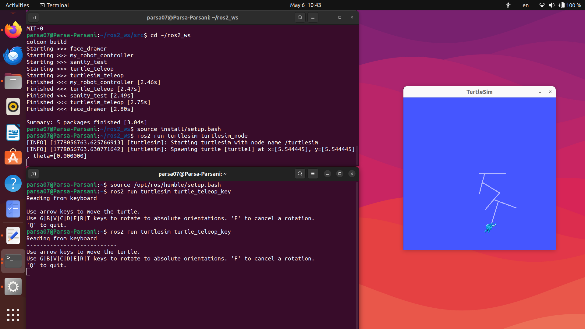

Here’s a clean beginner-friendly README you can directly paste into your `README.md` file.

# ROS 2 Turtlesim Teleoperation

## Overview

This project demonstrates a simple teleoperation system using ROS 2 Humble and Turtlesim.

The turtle can be controlled in real-time using keyboard inputs. The project explores the core ROS 2 concepts such as nodes, topics, publishers, subscribers, and message communication.

This project was developed as a beginner robotics project to strengthen my understanding of ROS 2 communication and robotics middleware systems.

---

## Features

* Keyboard-based teleoperation
* Real-time turtle movement
* ROS 2 publisher/subscriber communication
* Velocity command publishing
* Turtlesim simulation
* Beginner-friendly ROS 2 project

---

## Technologies Used

* ROS 2 Humble
* Python
* Turtlesim
* Ubuntu 22.04
* Git & GitHub

---

## ROS 2 Communication Flow

```text
Keyboard Input
        ↓
Teleop Node
        ↓
/turtle1/cmd_vel Topic
        ↓
Turtlesim Node
        ↓
Turtle Movement
```

---

## Installation

### Clone the Repository

```bash
git clone https://github.com/PYF07/ros2-turtlesim-teleoperation.git
```

### Go to Workspace

```bash
cd ros2_ws
```

### Build the Workspace

```bash
colcon build
```

### Source the Workspace

```bash
source install/setup.bash
```

---

## Usage

### Run Turtlesim

```bash
ros2 run turtlesim turtlesim_node
```

### Run Keyboard Teleoperation

Open a new terminal and run:

```bash
ros2 run turtlesim turtle_teleop_key
```

Use the keyboard to move the turtle in real time.

---

## Demo

### Turtlesim Simulation



---

## What I Learned

Through this project, I learned:

* ROS 2 node communication
* Topics and message passing
* Publisher/subscriber architecture
* Linux terminal workflow
* Git and GitHub basics
* Robotics middleware fundamentals

---

## Future Improvements

* Create a custom teleoperation node
* Add speed control
* Add autonomous movement
* Create launch files
* Add obstacle avoidance

---

## Author

Parsa Yadollahi

Robotics enthusiast exploring ROS 2, autonomous systems, and robotics software engineering.
